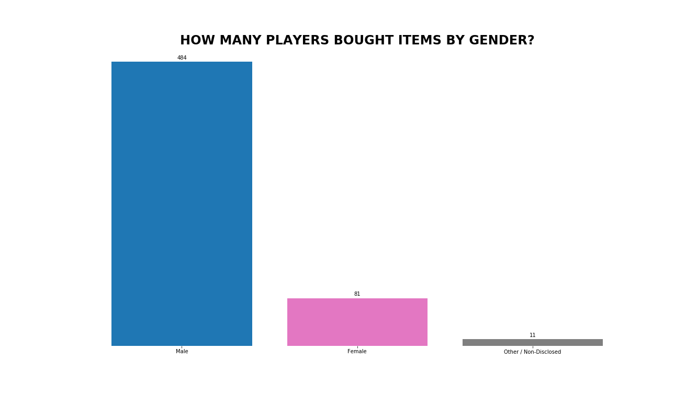
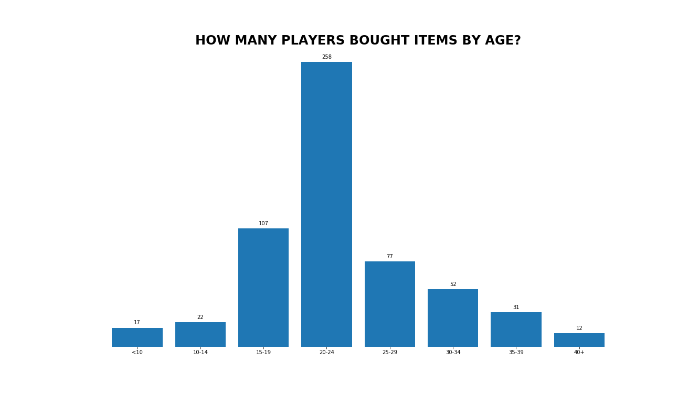
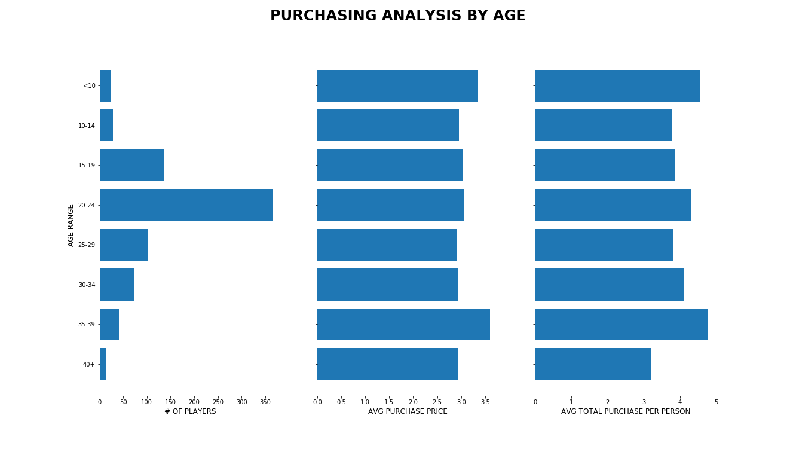
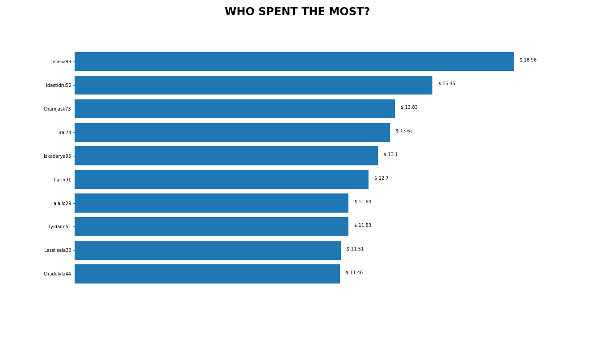
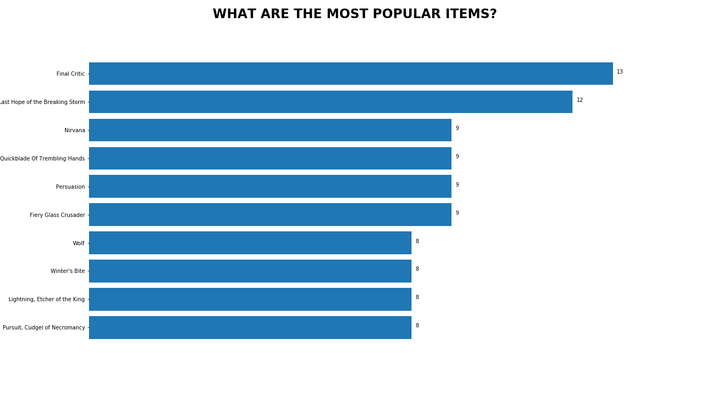
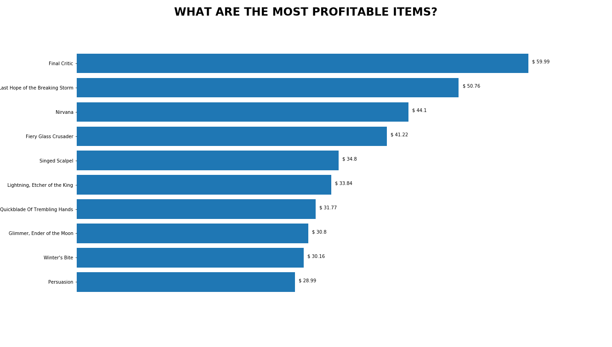

# Heroes of Pymoli - Sales Analysis

## Background
Heroes of Pymoli is a free-to-play game, but players are encouraged to purchase optional items that enhance their playing experience. As a first task, the company wants a report that breaks down the game's purchasing data into meaningful insights.

## Sales Analysis:
- **576** players purchased **780** in-game items producing **2379.77 USD** in total sales
- Most players that purchased items were **men (84%)** while only a few were **women (14%)**
- Although Pymoli is predominatly men, ***women tend to spend more money*** on average than men, indicating more marketing should be spent on women who could potentially drive more in-game sales.

- Most Pymoli players fell into the age ranges of **20-24 (45%)** followed by **15-19 (19%)** indicating a high school and college audience. These players consume a lot of social media, so we can maximize our ads to be on social. Players have also used these purchases to increase their social status in game.

- These were to top 3 spenders: ***Lisosia93 (18.96 USD), Idastidru52 (15.45 USD), Chamjask73 (13.83 USD)***. We should send these players thank you notes for their continued support of Pymoli and continue developing new items for these players.

- The **'Final Critic'** drove the most sales (59.99 USD) and largest volume purchased (13)

